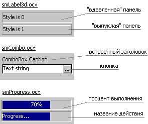



## Useful ActiveX to make MS Office Style for your application

### Description

Just see to picture and download zip. There are 4 projects: 3 useful controls to make your application like Microsoft Programs.

3D-Label - funny label;

ComboBox - Combo without items list, but with button, which you can use to open another window. It can be useful if your list very big and it's not necessary to load this list everytime...

ProgressBar - Bar, which can display text message or percent of laoding.

The last project is test application.
 
### More Info
 

             |
---                |---
**Submitted On**   |2000-12-14 21:30:46
**By**             |[Alexei Smirnov](https://github.com/Planet-Source-Code/PSCIndex/blob/master/ByAuthor/alexei-smirnov.md)
**Level**          |Intermediate
**User Rating**    |4.3 (13 globes from 3 users)
**Compatibility**  |VB 6\.0
**Category**       |[OLE/ COM/ DCOM/ Active\-X](https://github.com/Planet-Source-Code/PSCIndex/blob/master/ByCategory/ole-com-dcom-active-x__1-29.md)
**World**          |[Visual Basic](https://github.com/Planet-Source-Code/PSCIndex/blob/master/ByWorld/visual-basic.md)
**Archive File**   |[CODE\_UPLOAD13443162001\.zip](https://github.com/Planet-Source-Code/alexei-smirnov-useful-activex-to-make-ms-office-style-for-your-application__1-14180/archive/master.zip)

